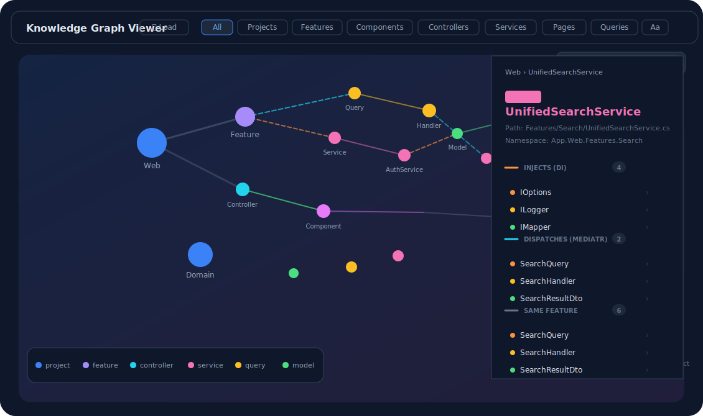
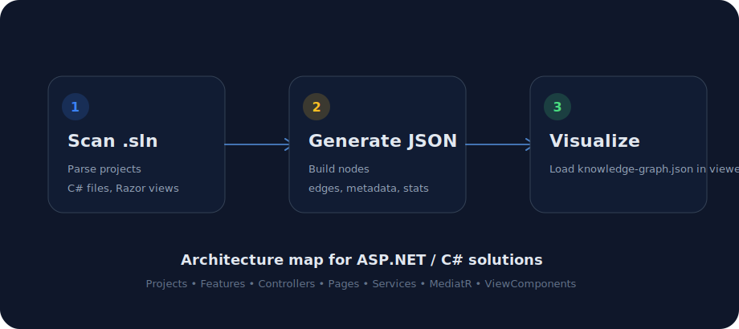
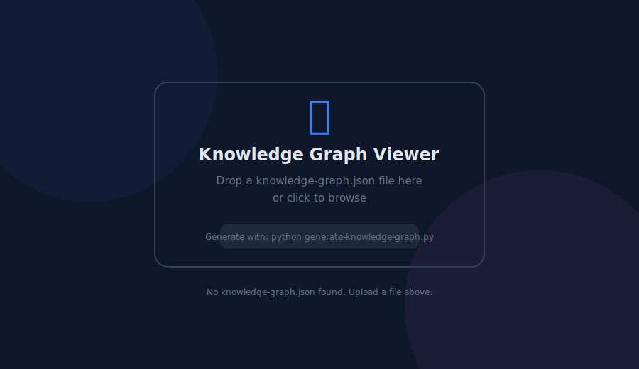
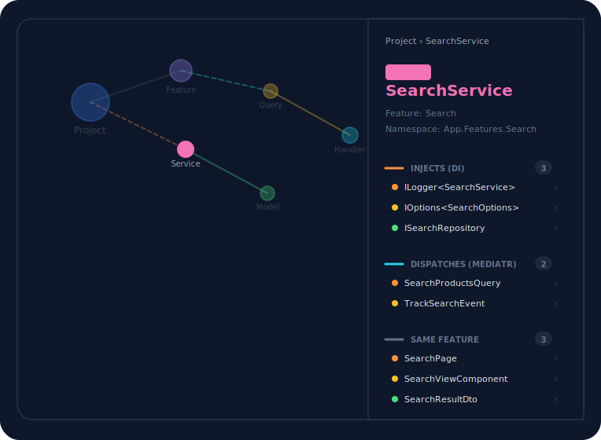

# C# Solution Architecture Graph Generator

<p align="center">
  
</p>

<p align="center">
  <strong>Generate an interactive architecture graph from a .NET / C# solution.</strong><br>
  Scan projects, controllers, Razor Pages, ViewComponents, services, MediatR flows, models, and dependency relationships — then visualize them in a browser-based graph viewer.
</p>

---

## Overview

**C# Solution Architecture Graph Generator** is a lightweight Python tool that analyzes a `.NET` / `C#` solution file and generates a `knowledge-graph.json` file.

The generated JSON can be loaded into the included `knowledge-graph-viewer.html` to explore your application as an interactive graph.

This is useful when you want to understand a large codebase, document system architecture, review dependencies, or onboard developers faster.

---

## Visual Workflow

<p align="center">
  
</p>

```text
C# solution (.sln)
        ↓
generate-knowledge-graph.py
        ↓
knowledge-graph.json
        ↓
knowledge-graph-viewer.html
```

---

## Viewer Preview

The viewer provides a dark, interactive D3-based interface for exploring your generated graph.

<p align="center">
  
</p>

<p align="center">
  
</p>

### Viewer Features

- Drag and drop a `knowledge-graph.json` file into the viewer
- Auto-load `knowledge-graph.json` when served from the same folder
- Filter by node type: projects, features, components, controllers, services, pages, queries, and infrastructure
- Search nodes by name, namespace, feature, ID, or type
- Click a node to inspect incoming and outgoing relationships
- View constructor dependency injection links
- View MediatR dispatch and handler relationships
- View Razor Page and ViewComponent rendering relationships
- Toggle labels and zoom around large graphs
- See graph statistics and a color legend

---

## What It Detects

The generator scans your C# solution and detects common ASP.NET / .NET application artifacts.

| Artifact | Description |
|---|---|
| Projects | Projects listed inside the `.sln` file |
| Project references | `.csproj` references between projects |
| Controllers | MVC / API controllers |
| Razor Pages | PageModel-based Razor Pages |
| ViewComponents | ASP.NET ViewComponent classes |
| Services | Service classes and interface-based implementations |
| MediatR requests | Queries, commands, requests, and stream requests |
| MediatR handlers | Request, command, query, notification, and stream handlers |
| Constructor DI | Constructor-injected dependencies |
| Razor component usage | `<vc:component-name>` usage inside `.cshtml` files |
| Feature folders | Feature, area, module, or domain folder grouping |
| Models / DTOs | Models, ViewModels, DTOs, requests, responses, commands, and events |
| Routes | Route and HTTP route attributes |

---

## Relationship Types

The output graph contains **nodes** and **edges**.

Example relationships:

```text
Project      → dependsOn  → Project
Class        → belongsTo  → Feature
Controller   → injects    → Service
Razor Page   → renders    → ViewComponent
Service      → dispatches → Query / Command
Handler      → invokes    → Query / Command
```

| Relationship | Meaning |
|---|---|
| `dependsOn` | One project references another project |
| `belongsTo` | A class belongs to a detected feature/folder |
| `injects` | A class receives another service/class through constructor dependency injection |
| `dispatches` | A class sends or publishes a MediatR request |
| `invokes` | A handler handles a MediatR request |
| `renders` | A Razor file renders a ViewComponent |

---

## Requirements

- Python **3.8+**
- A `.NET` / `C#` solution file (`.sln`)
- A modern browser for the HTML viewer

No external Python packages are required. The generator uses only the Python standard library.

---

## Installation

Clone or copy this repository into your local machine:

```bash
git clone https://github.com/your-username/csharp-solution-architecture-graph.git
cd csharp-solution-architecture-graph
```

Or simply place these files inside any folder:

```text
generate-knowledge-graph.py
knowledge-graph-viewer.html
README.md
```

---

## Usage

### 1. Generate the graph JSON

Run the script and provide the path to your solution:

```bash
python generate-knowledge-graph.py --solution path/to/YourSolution.sln
```

By default, the output will be created as:

```text
knowledge-graph.json
```

inside the same folder as the `.sln` file.

---

### 2. Open the viewer

Open:

```text
knowledge-graph-viewer.html
```

Then drag and drop the generated `knowledge-graph.json` file into the viewer.

If you serve the folder locally and `knowledge-graph.json` is in the same directory as the viewer, the viewer will try to auto-load it.

Example local server:

```bash
python -m http.server 8080
```

Then open:

```text
http://localhost:8080/knowledge-graph-viewer.html
```

---

## Command Line Options

| Option | Alias | Description |
|---|---:|---|
| `--solution` | `-s` | Path to the `.sln` file |
| `--output` | `-o` | Output path for the generated JSON file |
| `--exclude-tests` |  | Exclude test/spec projects |
| `--connected-only` |  | Keep only nodes that have at least one graph relationship |

---

## Examples

### Analyze a solution

```bash
python generate-knowledge-graph.py --solution src/MyApp.sln
```

### Save the output to a custom file

```bash
python generate-knowledge-graph.py --solution src/MyApp.sln --output my-graph.json
```

### Exclude test projects

```bash
python generate-knowledge-graph.py --solution src/MyApp.sln --exclude-tests
```

### Reduce graph noise

```bash
python generate-knowledge-graph.py --solution src/MyApp.sln --connected-only
```

---

## Output Format

The generated JSON has this structure:

```json
{
  "metadata": {
    "title": "MyApp — Knowledge Graph",
    "description": "Auto-generated knowledge graph for MyApp.sln",
    "generatedAt": "2026-01-01T00:00:00Z",
    "generator": "generate-knowledge-graph.py",
    "solutionName": "MyApp"
  },
  "nodes": [],
  "edges": [],
  "statistics": {
    "totalNodes": 0,
    "totalEdges": 0,
    "nodesByType": {},
    "edgesByRelationship": {}
  }
}
```

---

## Node Types

| Node Type | Description |
|---|---|
| `project` | A C# project from the solution |
| `feature` | A detected feature/module/folder grouping |
| `controller` | ASP.NET MVC or API controller |
| `razorView` | Razor Page model |
| `viewComponent` | ASP.NET ViewComponent |
| `service` | Application, domain, or infrastructure service |
| `query` | MediatR query, command, request, or stream request |
| `messageHandler` | MediatR request/command/query/notification handler |
| `model` | Model, DTO, request, response, event, or view model |

---

## Suggested Repository Structure

```text
.
├── generate-knowledge-graph.py
├── knowledge-graph-viewer.html
├── README.md
└── docs/
    └── images/
        ├── viewer-preview.svg
        ├── upload-screen.svg
        ├── node-detail-panel.svg
        └── workflow.svg
```

---

## Why Use This?

Large C# applications can be hard to understand by reading files one by one.

This tool helps you answer questions like:

- Which services are used by this page?
- Which controller dispatches this query?
- Which handler handles this command?
- Which ViewComponent is rendered by this Razor page?
- Which project depends on another project?
- Which classes belong to the same feature folder?
- Which parts of the system are highly connected?

---

## Limitations

This tool performs lightweight static analysis using regular expressions and project file parsing.

It is fast and dependency-free, but it may not detect every advanced C# pattern.

Known limitations:

- Complex nested generics may not be parsed perfectly
- Reflection-based dependencies are not detected
- Runtime service resolution may not be detected
- Some minimal API mappings may require future support
- Some advanced routing conventions may not be fully resolved
- Accuracy depends partly on common ASP.NET and C# naming conventions

---

## Roadmap Ideas

- Mermaid diagram export
- Graphviz `.dot` export
- Markdown architecture report generation
- Minimal API endpoint detection
- Background service detection
- Repository pattern detection
- Dependency registration analysis from `Program.cs` / `Startup.cs`
- CI/CD integration
- Graph search and clustering improvements
- Export selected subgraphs

---

## License

```text
MIT License
```


## Author

Created to help developers visualize and understand C# solution architecture.
